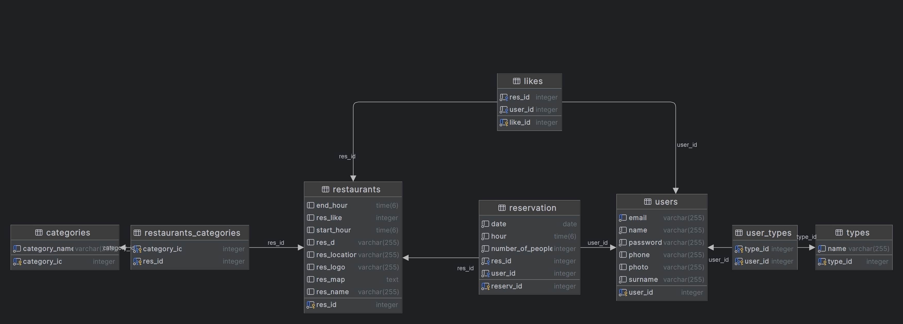

# ZTPAI2324

# Online Restaurant Reservation Web Application

## Table of Contents

- [Introduction](#introduction)
- [Features](#features)
- [Technologies](#technologies)
- [Diagram ERD](#diagram-erd)
- [Screenshots from app](#screenshots-from-app)

## Introduction

Welcome to the Online Restaurant Reservation App project! This application aims to simplify the process of reserving tables in restaurants, providing users with convenience and flexibility in planning their dining experiences.

## Features

- User registration and authentication
- Restaurant search and browsing
- Reservation creation and management 
- Restaurant creation and management (only for admin)
- User ratings for restaurants

### Technologies

- REACT.JS
- SPRING
- JS
- DOCKER
- POSTGRESQL

### Diagram ERD

### Screenshots from app

Home page :

Restaurant page :

My reservation page :

